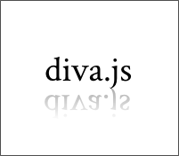

This is my home on the Internet. On the left is my current Gravatar. Below you can find links to current and past projects of mine. If you want to learn more about me, click [about](/about). If you want to read things I've written for various purposes, you can find my writing under the aptly-named [writing](/writing) section. Cheers.

projects
--------
			<table id="projects-grid">
			<colgroup>
				<col span="1" style="width: 200px;">
				<col span="1" style="width: 180px">
				<col span="1" style="width: 200px;">
				<col span="1" style="width: 180px;">
				<col span="1" style="width: 200px;">
			</colgroup>
				<tr>
					<td> I've been a moderator with phpBB since October 2007, and am currently working on several modifications. Click to find out more.</td>
					<td></td>
					<td> An unofficial open source wiki-based resource for the courses at McGill University. Side projects include converting to wikicode from other formats and vice versa. Click to find out more.</td>
					<td></td>
					<td> An open source document viewer for high-resolution scanned documents, particularly music. Spring of 2011 to present, for McGill's Department of Music Technology.</td>
				</tr>
				<tr>
					<td> As the USG-IT for this Model UN conference at McGill, I redesigned the site and built a content management system around phpBB. The source of the site is <a href="https://www.github.com/dellsyste/ssuns-2011">available at github</a>.</td>
					<td></td>
					<td> A silly thing I made with a friend in high school. Click at your peril.</td>
					<td></td>
					<td></td>
				</tr>
			</table>
