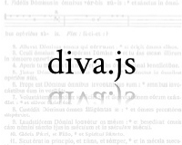
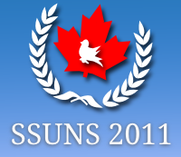

Interested in hiring me for something, or getting involved in any of my projects? [Contact me](/about#contact_info).

phpBB is a popular open source bulletin board system written, shockingly, in PHP. I've been a moderator since October 2007 and a website team member since July 2011, and am currently working on several MODifications, the details of which can be found [here](phpbb).

 

An open source document viewer for high-resolution scanned documents, particularly music. Written as a jQuery plugin, with the source [available on github](https://www.github.com/DDMAL/diva.js). Spring of 2011 to present, for McGill's Department of Music Technology. <a href="http://ddmal.music.mcgill.ca/diva">Find out more here.</a>

 

An unofficial open source wiki-based resource for the courses at McGill University. As one of the admins, I'm working on improving the quality of the content, redesigning the site and moving from MediaWiki to Django (work in progress - the source is [available on github](https://www.github.com/dellsystem/wikinotes)). The site can be found at [www.wikinotes.ca](http://www.wikinotes.ca).

 

As the USG-IT for this Model UN conference at McGill, I redesigned the site and built a content management system around phpBB. The source of the site is [available on github](https://www.github.com/dellsystem/ssuns-2011); pull requests are welcomed.
